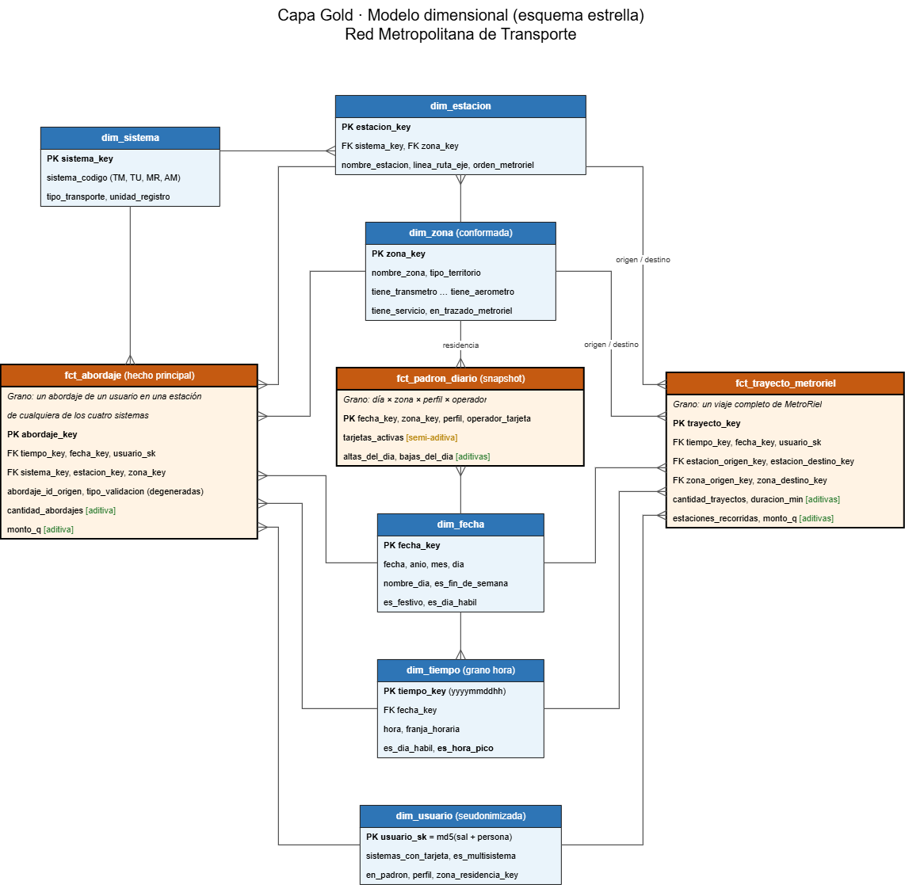

# 1.4 Diseño dimensional y capa Gold

## Grano de la tabla de hechos principal

> **`fct_abordaje`: una fila por cada abordaje (validación de entrada) de un usuario en una estación de cualquiera de los cuatro sistemas.**

**Por qué "un abordaje" y no "un viaje puerta a puerta":** tres de los cuatro sistemas solo registran abordajes. Para tener viajes puerta a puerta habría que inventarlos encadenando validaciones (¿cuántos minutos separan un transbordo de un viaje nuevo?), y eso mete supuestos en la tabla principal. El abordaje es lo único que registran los cuatro.

**MetroRiel sí está en la tabla principal.** De cada viaje de MetroRiel sacamos su abordaje (estación y hora de entrada) y lo metemos en `fct_abordaje` igual que los otros tres. Así la demanda por modo, zona y hora está completa con los cuatro modos. El viaje completo (salida, duración, estaciones recorridas) no se pierde: va en una segunda tabla de hechos, `fct_trayecto_metroriel`, con su propio grano. Ninguna tabla mezcla granos.

| Sistema | Filas en `fct_abordaje` |
|---|---:|
| Transmetro | 362,106 |
| Transurbano | 786,398 |
| MetroRiel | 295,511 |
| Aerómetro | 203,554 |
| **Total** | **1,647,569** |

## Matriz del bus

| Proceso de negocio (tabla de hechos) | Fecha | Tiempo (hora) | Sistema | Estación | Zona | Usuario |
|---|:-:|:-:|:-:|:-:|:-:|:-:|
| Abordajes (`fct_abordaje`) | ✓ | ✓ | ✓ | ✓ | ✓ | ✓ |
| Trayectos MetroRiel (`fct_trayecto_metroriel`) | ✓ | ✓ | (MR) | ✓ origen / destino | ✓ origen / destino | ✓ |
| Padrón de tarjetas (`fct_padron_diario`) | ✓ | | ✓ operador de la tarjeta | | ✓ residencia | |

Las **dimensiones conformadas** son las mismas tablas para todos los procesos: `dim_fecha`, `dim_tiempo`, `dim_sistema`, `dim_estacion`, `dim_zona` y `dim_usuario`. En `fct_trayecto_metroriel`, `dim_zona` y `dim_estacion` juegan dos roles (origen y destino).

## Diagrama del modelo

Imagen: `docs/1.4-diagrama-modelo.png` (también en PDF: `docs/1.4-diagrama-modelo.pdf`).

## Dimensión tiempo

`dim_tiempo` tiene grano **hora** (8,760 filas para 2026) y se enrolla a `dim_fecha` (grano día):

- `hora` (0–23) y `franja_horaria` (madrugada, mañana, tarde, noche).
- `es_dia_habil`: de lunes a viernes y que no sea asueto. Los asuetos están en el seed `festivos_gt.csv`; en el periodo de los datos (1-jun al 15-jul-2026) cae el 30 de junio, Día del Ejército.
- `es_hora_pico` (**definición oficial**): día hábil **y** hora entre 06:00–08:59 o 17:00–19:59.

## Clasificación de medidas

| Medida | Tabla | Tipo | Por qué |
|---|---|---|---|
| `cantidad_abordajes` | fct_abordaje | **Aditiva** | Se suma en cualquier dimensión: por zona, hora, sistema o mes. |
| `monto_q` | fct_abordaje, fct_trayecto_metroriel | **Aditiva** | El ingreso se suma en cualquier dimensión. |
| `cantidad_trayectos` | fct_trayecto_metroriel | **Aditiva** | |
| `duracion_min` | fct_trayecto_metroriel | **Aditiva** | Los minutos totales se suman. Su promedio no (ver abajo). |
| `estaciones_recorridas` | fct_trayecto_metroriel | **Aditiva** | |
| `altas_del_dia`, `bajas_del_dia` | fct_padron_diario | **Aditiva** | Son flujos: se suman entre días. |
| `tarjetas_activas` | fct_padron_diario | **Semi-aditiva** | Es un saldo. Se suma entre zonas, perfiles u operadores, pero **no entre días**: 19,000 activas el lunes más 19,000 el martes no son 38,000 tarjetas. En el tiempo se toma el último día o el promedio. |
| Usuarios distintos | derivada | **No aditiva** | Un usuario que viaja en dos zonas se contaría dos veces. Se calcula con `count(distinct usuario_sk)` en cada nivel. |
| Duración promedio, tarifa promedio | derivada | **No aditiva** | Es un cociente: se recalcula como suma de minutos / suma de trayectos. |
| % de abordajes en hora pico | derivada | **No aditiva** | Es un cociente. |

## DDL

El DDL completo, con llaves primarias y foráneas, está en [`1.4-ddl-gold.sql`](1.4-ddl-gold.sql). Se genera desde el warehouse con `herramientas/ddl.py`, que además **lo ejecuta en una base vacía para validarlo**.

## Regla: Gold nunca lee Bronze

Todos los modelos de Gold usan `ref()` sobre Silver y ninguno usa `source()`. El flujo lo revisa en cada corrida (tarea `verificar_linaje`, que lee `manifest.json` de dbt) y se detiene si algún modelo Gold lee de Bronze.

## Filas en Gold (medido)

| Tabla | Filas |
|---|---:|
| fct_abordaje | 1,647,569 |
| fct_trayecto_metroriel | 295,511 |
| fct_padron_diario | 8,612 |
| dim_usuario | 70,380 |
| dim_estacion | 468 |
| dim_zona | 26 (22 zonas + 4 municipios) |
| dim_tiempo | 8,760 |
| dim_fecha | 365 |
| dim_sistema | 4 |

`dim_zona` ya trae la cobertura para el tablero: 15 territorios tienen al menos una estación. Los 11 sin servicio de ningún modo son las zonas 2, 3, 5, 14, 15, 16, 19, 21, 24 y 25 y el municipio de Santa Catarina Pinula; este último tiene residentes en el padrón pero ninguna estación.
